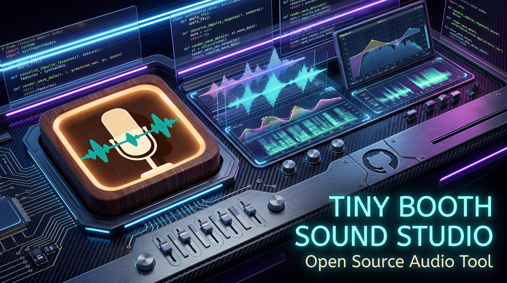

<p align="center">
  
</p>

# TinyBooth Sound Studio

Channel recorder, visualizer, and TinyBooth project exporter. Native Rust + egui desktop app for Windows — the bedroom-studio opposite of a corporate DAW.

## What it does

- **Record** — pick an input device, choose a channel or stereo L/R, hit ⏺. Each take goes to a separate WAV under a TinyBooth project folder, processed through the active recording-tone profile.
- **Visualize live** — scrolling waveform, FFT spectrum, peak meter.
- **Project** — rename / mute / gain / trim tracks. JSON manifest + sibling WAVs; the `.tinybooth` file is self-contained and carries the profile snapshot for every take.
- **Export** — mix to WAV (native) or FLAC / MP3 / Ogg Vorbis / Ogg Opus / M4A-AAC (via ffmpeg, dropped next to the exe or on `PATH`).

## Recording tones

Opinionated presets for shoestring-budget capture. Guitar is the default — the tool is tuned for one person, one mic, one take.

| Preset | HPF | Gate | Compressor | Notes |
|---|---|---|---|---|
| **Guitar** (default) | 60 Hz | off | 2.5:1, 20 / 150 ms, +3 dB makeup | Keeps decay, evens strums |
| **Vocals** | 100 Hz | −42 dB, 3 / 80 ms | 3.5:1, 8 / 120 ms, +4 dB | Intelligibility over air |
| **Wind / Brass** | 50 Hz | off | 2:1, 15 / 180 ms, +1 dB | Breath is the sound |
| **Drums / Percussion** | off | off | 4:1, 3 / 80 ms, +2 dB | Transient-forward, wide headroom |
| **Raw / Clean** | off | off | off | No processing, bit-exact capture |

Every parameter is editable under **Admin → Recording-tone profiles…** and persists to `%APPDATA%\TinyBooth Sound Studio\profiles.json`.

## Documentation

The full manual lives at [`docs/manual/`](docs/manual/) — twelve chapters covering every shipped feature, with appendices on troubleshooting and file formats. The same Markdown files are embedded into the binary at compile time, so the in-app **Help → Manual…** window (or **F1** anywhere) shows byte-identical content. Edit a chapter and it updates both surfaces on the next build.

For developers / contributors:

- **[`docs/architecture.md`](docs/architecture.md)** — current application anatomy: module map, threading model, three principal flows, schema versioning, build & release pipeline.
- **[`docs/rust-survival-guide.md`](docs/rust-survival-guide.md)** — opinionated field manual for shipping Rust desktop apps. Project structure, error handling, threading, GUI patterns, serialisation compatibility, build/dist, CI, self-update, logging, testing, dependency hygiene, performance, security.
- **[`docs/audit/`](docs/audit/)** — periodic clinical audits of the codebase with categorised findings and prioritised refactor suggestions. Latest: [2026-04-27 (v0.3.5)](docs/audit/2026-04-27-codebase-audit.md).
- **[`docs/feature-requests/`](docs/feature-requests/)** — formal RFCs (TBSS-FR-NNNN) for past and proposed features.

| Welcome | Reference | Appendix |
|---|---|---|
| [Welcome](docs/manual/00-index.md) | [Recording](docs/manual/02-recording.md) | [Troubleshooting](docs/manual/appendix-a-troubleshooting.md) |
| [Getting started](docs/manual/01-getting-started.md) | [Recording tones](docs/manual/03-recording-tones.md) | [File formats](docs/manual/appendix-b-file-formats.md) |
| | [Editing profiles (Admin)](docs/manual/04-admin.md) | |
| | [Projects](docs/manual/05-projects.md) | |
| | [Export](docs/manual/06-export.md) | |
| | [Importing Suno stems](docs/manual/07-suno-import.md) | |
| | [Self-update](docs/manual/08-self-update.md) | |
| | [Mix tab — remastering](docs/manual/10-mix.md) | |
| | [Using this manual](docs/manual/09-using-this-manual.md) | |

## Install

Grab the latest `.msi` from [Releases](https://github.com/ophiocus/TinyBoothSoundStudio/releases) and run it. The installer places the app in Program Files with a Desktop shortcut; the built-in updater surfaces new releases on each launch.

## Build from source

```powershell
cargo build --release
```

For the Windows MSI (requires [WiX Toolset 3.11](https://github.com/wixtoolset/wix3/releases/tag/wix3112rtm) on `PATH`):

```powershell
cargo install cargo-wix
cargo wix
```

## Project layout

```
.
├── Cargo.toml
├── build.rs                  # git-tag versioning + winres icon embed
├── src/
│   ├── main.rs               # eframe entry + viewport icon
│   ├── app.rs                # tab state, top + bottom bars
│   ├── audio.rs              # cpal input, SourceMode, WAV writer
│   ├── dsp.rs                # Profile + FilterChain / FilterChainStereo
│   ├── analysis.rs           # FFT spectrum + waveform peak decimator
│   ├── project.rs            # .tinybooth JSON manifest
│   ├── export.rs             # WAV native + ffmpeg subprocess
│   ├── git_update.rs         # GitHub releases self-updater
│   ├── manual.rs             # in-app manual: include_str! of docs/manual/
│   ├── suno_import.rs        # Suno stem-bundle ingester
│   └── ui/                   # record, project, export, admin, manual, viz
├── docs/
│   ├── manual/               # ← single source of truth, browsable on GitHub,
│   │                         #   embedded into the exe at build time
│   ├── feature-requests/
│   └── research/
├── wix/main.wxs              # MSI installer
├── assets/                   # icon, banner, source PNGs
└── .github/workflows/        # tag-push → MSI → GitHub Release
```

## Status

Current version: see [Releases](https://github.com/ophiocus/TinyBoothSoundStudio/releases). Feature requests live under [`docs/feature-requests/`](docs/feature-requests/).

Built with Rust + [egui](https://github.com/emilk/egui) · [cpal](https://github.com/RustAudio/cpal) · [hound](https://github.com/ruuda/hound) · [rustfft](https://github.com/ejmahler/RustFFT) · [biquad](https://github.com/korken89/biquad-rs).
